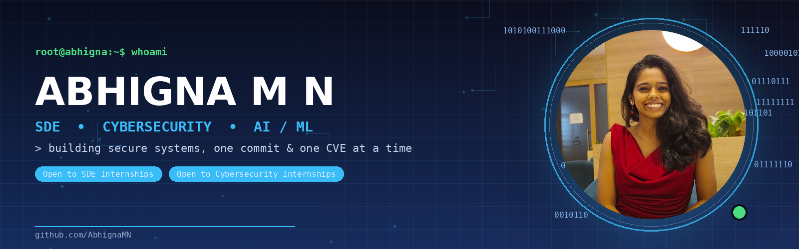

<!--
============================================================
  Replace before publishing:
  YOUR_USERNAME        -> AbhignaMN
  YOUR_LINKEDIN         -> https://www.linkedin.com/in/abhigna-m-n-0a8752295/
  YOUR_LEETCODE_USERNAME-> Abhigna_
  YOUR_NEETCODE_PROFILE -> add your NeetCode profile link here if public
============================================================
-->

<div align="center">



<a href="https://git.io/typing-svg"></a>

<p>
  <a href="mailto:abhigna2324@gmail.com"></a>
  <a href="https://www.linkedin.com/in/abhigna-m-n-0a8752295/"></a>
  <a href="https://github.com/AbhignaMN"></a>
  <a href="https://leetcode.com/u/Abhigna_/"></a>
</p>

</div>

---

### 🙋 About Me

```yaml
role:        Computer Science Undergrad (B.E, CGPA 9.25/10) @ Global Academy of Technology
focus:       Software Development Engineering (SDE) & Cybersecurity
also_into:   AI/ML systems, Cloud, Computer Vision
looking_for: SDE & Cybersecurity Internships — 2026
currently:   Ranked Top 15% - Edunet Full Stack Internship | Top 10% - TryHackMe
```

- 🛡️ Hands-on with **penetration testing, network scanning & ethical hacking** — NIELIT Calicut
- 💻 Full-stack engineering across **Java, React, SQL Server, REST APIs** — Edunet Foundation
- 🧠 Built production-style **AI/ML systems** — 96.93% accuracy pneumonia classifier, real-time traffic CV pipeline
- 🌱 Sharpening DSA daily and going deeper into **cloud security & applied deep learning**
- ⚡ Fun fact: I'd rather break an app with Nmap before someone else does

---

### 🛠️ Tech Arsenal

<div align="center">

**Languages**
<br/>


**Frontend & Backend**
<br/>


**Databases**
<br/>


**AI / ML / CV**
<br/>


**Cybersecurity Tooling**
<br/>


**Core CS**
<br/>


</div>

---

### 📊 GitHub Stats

<div align="center">


</div>

<div align="center">

</div>

---

### 🧮 DSA / Problem Solving

<div align="center">


</div>

> 📌 Actively grinding DSA on **[NeetCode](https://neetcode.io/)** — LeetCode profile linked above for the record, but most day-to-day practice happens on NeetCode's roadmap. Happy to share progress/solutions if you're curious!

---

### 🏆 Achievements & Certifications

| 🏅 | Achievement |
|----|-------------|
| 🥇 | Top 10% Performer — **TryHackMe** |
| 📜 | **Cisco Certified Network Associate (CCNA)** — Cisco Networking Academy |
| 🧩 | IBM Z Datathon — Participant (2024, 2025) |
| 📈 | Top 15% — **Edunet Foundation** Full Stack Internship |
| 🎓 | Python with Machine Learning — Udemy |
| 🏫 | 12th Grade — 97% · 10th Grade — 99.67% |

---

### 🚀 Featured Projects

<table>
<tr>
<td width="50%" valign="top">

**🫁 Pneumonia Detection — Multi-Model Ensemble**

Fine-tuned ResNet18 CNN + ensemble of 5 ML classifiers (SVM, RF, KNN, LogReg, Naive Bayes) for chest X-ray classification.

- ✅ **96.93%** validation accuracy
- ⚡ Streamlit app analyzing 5,000+ X-rays in real time
- 🔍 Grad-CAM heatmaps for explainability

`Python` `PyTorch` `Streamlit` `scikit-learn` `OpenCV` `Grad-CAM`

</td>
<td width="50%" valign="top">

**🚦 Lane Guardian — AI Traffic Surveillance**

Real-time vehicle detection & multi-object tracking system for traffic monitoring.

- 🎯 YOLOv10 + ByteTrack for detection & tracking
- 📊 Live dashboard: vehicle count, lane occupancy, congestion, violations

`Python` `YOLOv10` `ByteTrack` `OpenCV`

</td>
</tr>
<tr>
<td width="50%" valign="top">

**🛡️ Security Toolkit — Port Scanner, Keylogger, Hasher**

Built during NIELIT Calicut Cyber Security internship — Python utilities for reconnaissance and credential security, exercised alongside Nmap/Metasploit-based pentesting labs.

`Python` `Nmap` `Metasploit` `Ethical Hacking`

</td>
<td width="50%" valign="top">

**🎓 Student & Timetable Management Systems**

Full-stack CRUD applications built during the Edunet Foundation internship, with REST API testing via Postman.

`Java` `React` `SQL Server` `Postman`

</td>
</tr>
</table>

---

### 📚 Currently Leveling Up

<div align="center">


</div>

---

### 🐍 Contribution Snake

<div align="center">

</div>

<sub>Generated by the `snake.yml` GitHub Action already in this repo — runs automatically, no manual updates needed.</sub>

---

<div align="center">

### 📫 Let's Connect

**Open to SDE & Cybersecurity internship opportunities — always happy to talk security, systems, or ML.**

<a href="mailto:abhigna2324@gmail.com"></a>
<a href="https://www.linkedin.com/in/abhigna-m-n-0a8752295/"></a>


</div>
